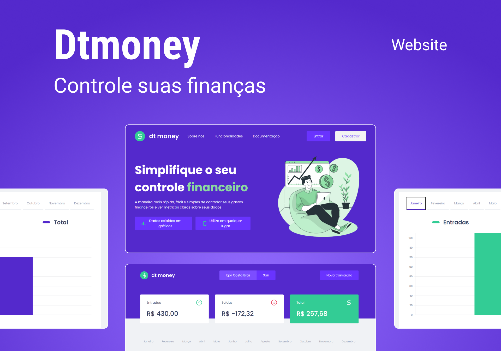

<!-- Logo -->

  
  
  
  

    

  
<!-- Atribuições-->
Projeto inicial Ignite ReactJs, na <a href="https://rocketseat.com.br/"><em>Rocketseat</em></a>

## 🧪 Tecnologias

Esse projeto foi desenvolvido com as seguintes tecnologias:
- [React](https://reactjs.org)
- [TypeScript](https://www.typescriptlang.org/)
- [React-vis](https://uber.github.io/react-vis/)
- [Styled Components](https://styled-components.com/)
## 💻 Projeto

[DtMoney](https://dtmoney-igorcbraz.netlify.app/) é um website para organizar suas finanças, com as opções para adicionar gastos ou ganhos, excluí-los ou edita-los, com métricas visuais em gráficos e opções de exportação em modelo CSV (Com foco em leitura no Excel).

Este é um projeto inicialmente desenvolvido no programa **[Ignite ReactJs](https://www.rocketseat.com.br/ignite)**, feito pela Rocketseat.
Após o término do curso o projeto foi e está sendo continuado e desenvolvido, seguindo os seguintes ajustes e melhorias.

## 📐 Ajustes e Melhorias 🔍
As seguintes funcionalidades foram feitas fora do curso _Ignite ReactJs_:

- [x] Backend em NodeJs
- [x] Sistema de Login e Cadastro de usuários
- [x] Filtro de transações por mês
- [x] Opção de Editar e Excluir transações
- [x] Gráficos com os dados das transações mensais 
- [x] Gráfico Circular com as 5 maiores despesas registradas
- [x] Responsividade do website 
- [x] Paginação das transações 
- [x] Landing Page Responsiva
- [x] Utilização tags meta para SEO

## 🔖 Layout
Você pode acessar o design inicial deesse projeto pelo link abaixo:

- [Layout no Figma](https://www.figma.com/file/0xmu9mj2TJYoIOubBFWsk5/dtmoney-Ignite-(Copy)?node-id=0%3A1)

> Lembrando que é necessário ter uma conta no [Figma](https://www.figma.com/login?cont=/developers) para acessar o projeto
