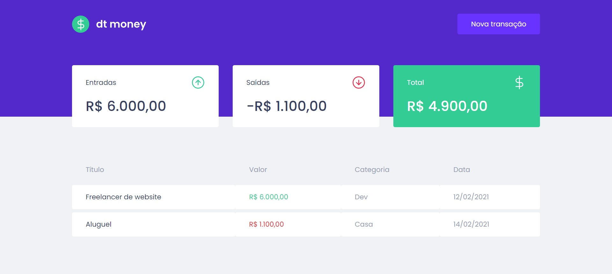

<!-- Logo -->

    

  
<!-- Atribuições-->
Projeto Ignite ReactJs, na <a href="https://rocketseat.com.br/"><em>Rocketseat</em></a>

## 🧪 Tecnologias

Esse projeto foi desenvolvido com as seguintes tecnologias:
- [React](https://reactjs.org)
- [TypeScript](https://www.typescriptlang.org/)
- [MirageJs](https://miragejs.com/)
- [Styled Components](https://styled-components.com/)
## 💻 Projeto

DtMoney é um website para organizar suas finanças, com as opções para adicionar gastos ou ganhos e ter uma métrica sobre esses dados. 

Este é um projeto desenvolvido no programa **[Ignite ReactJs](https://www.rocketseat.com.br/ignite)**, feito pela Rocketseat.

## 🔖 Layout
Você pode acessar o design deesse projeto pelo link abaixo:

- [Layout no Figma](https://www.figma.com/file/0xmu9mj2TJYoIOubBFWsk5/dtmoney-Ignite-(Copy)?node-id=0%3A1)

> Lembrando que é necessário ter uma conta no [Figma](https://www.figma.com/login?cont=/developers) para acessar o projeto
